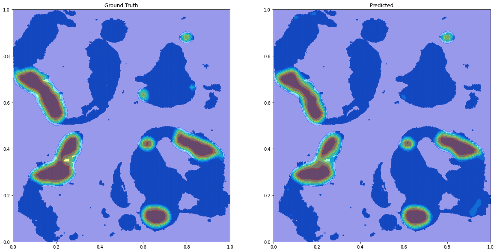

```python
import os
import torch
import pandas as pd
import numpy as np
import matplotlib.pyplot as plt
from torch.utils.data import Dataset, DataLoader
from torchvision import transforms, utils
import h5py
import numpy as np # linear algebra library
import cv2 # for image processing methods 
import matplotlib.pyplot as plt # visualisation tool
from matplotlib import gridspec

import pandas as pd
import os # for managing file paths and os operations
import sys # system specefic calls
import time 
import pdb # debug

from sklearn.metrics import confusion_matrix, classification_report

import torch # Deep learning framework
import torch.nn as nn 
import torch.nn.functional as F
import torch.optim as optim
import pytorch_lightning as pl

import torchvision # for creating datasets, and pretrained models
from torch.utils.tensorboard import SummaryWriter # visualise the learning
from  torch.utils.data import Dataset, DataLoader # parellel dataset loader
from torchvision import models, datasets, transforms, utils

from torchsummary import summary

import copy # to create deep copies
import pickle as pk # for serialization
```


```python
# import matplotlib
# matplotlib.use('Agg')
# import matplotlib.pyplot as plt
# import numpy as np
# from scipy import ndimage
# from scipy.spatial.distance import euclidean
# from scipy.optimize import linear_sum_assignment
# import pandas as pd
# from pdb import set_trace as bp
# import os
# import iocsv

# def computeAssignment(list_detections,list_gt,allowedDistance,save_disagreement=False):
#     #the assignment is based on the hungarian algorithm
#     #https://docs.scipy.org/doc/scipy-0.18.1/reference/generated/scipy.optimize.linear_sum_assignment.html
#     #https://en.wikipedia.org/wiki/Hungarian_algorithm
    
#     #build cost matrix
#     #rows: GT
#     #columns: detections
#     cost_matrix = np.zeros([len(list_gt),len(list_detections)])
#     for i, pointR1 in enumerate(list_gt):
#         for j, pointR2 in enumerate(list_detections): 
#             cost_matrix[i,j] = euclidean(pointR1,pointR2)
            
#     #perform assignment        
#     row_ind, col_ind = linear_sum_assignment(cost_matrix)
    
#     #threshold points too far
#     row_ind_thresholded = []
#     col_ind_thresholded = []
#     for i in range(len(row_ind)):
#         if cost_matrix[row_ind[i],col_ind[i]] < allowedDistance:
#             row_ind_thresholded.append(row_ind[i])
#             col_ind_thresholded.append(col_ind[i])
    
#     #save coord FP and FN
#     if save_disagreement:
#         #just copy the lists and remove correct detections
#         list_FN = list(list_gt) #list() to copy
#         list_FP = list(list_detections)
#         for i in range(len(row_ind_thresholded)):
#             list_FN.remove(list_gt[row_ind_thresholded[i]])
#             list_FP.remove(list_detections[col_ind_thresholded[i]])
                          
#     #compute stats
#     P = len(list_gt)
#     TP = len(row_ind_thresholded)
#     FP = len(list_detections) - TP
    
#     if save_disagreement:
#         return P,TP,FP,list_FP,list_FN
#     else:
#         return P,TP,FP  
        
# def saveCoordFNFP(list_ids,list_detections,list_gt,allowedDistance,index_pred_thresh, save_path):
#     #extract list predicted threshold
#     list_detections_thresh = []
#     for i in range(len(list_ids)):
#         list_detections_thresh.append(list_detections[i][-index_pred_thresh])
            
#     if not os.path.exists(os.path.join(save_path,'FPFN')):
#         os.mkdir(os.path.join(save_path,'FPFN'))
        
#     FNFPallimages = pd.DataFrame(index=list_ids,columns=['FP','FN','FP+FN'])
        
#     #iterate over scans
#     for image_nbr, gt in enumerate(list_gt):

#         image_id = list_ids[image_nbr]
#         if len(gt) > 0:  #check that ground truth contains at least one annotation
#             if len(list_detections_thresh[image_nbr]) > 0: #if there are detections
#                 #compute P, TP, FP per image
#                 _,_,_,list_FP,list_FN = computeAssignment(list_detections_thresh[image_nbr],gt,allowedDistance,save_disagreement=True)                
#             else:
#                 list_FP = []
#                 list_FN = gt
                    
#         elif len(gt) == 0 and len(list_detections_thresh[image_nbr]) > 0: #if no annotations but detections
#             list_FP = list_detections_thresh[image_nbr]
#             list_FN = []
            
#         elif len(gt) == 0 and len(list_detections_thresh[image_nbr]) == 0: #if no annotation and no detection
#             list_FP = []
#             list_FN = []
            
#         #nbr FP FN
#         FNFPallimages.loc[image_id] = pd.Series({'FP':len(list_FP),'FN':len(list_FN),'FP+FN':len(list_FP)+len(list_FN)})
#         nbr_FPFN = [['FP',len(list_FP)],['FN',len(list_FN)]]
        
#         #create a single list
# #        list_FPFN = []
# #        list_FPFN.append(['coord','FP'])
# #        for point in list_FP:
# #            list_FPFN.append([point,1])
# #        for point in list_FN:
# #            list_FPFN.append([point,0]) 
            
#         list_FPFN = pd.DataFrame(columns=['x','y','z','FP'])
#         for point in list_FP:
#             list_FPFN = list_FPFN.append({'x':point[0],'y':point[1],'z':point[2],'FP':1},ignore_index=True)
#         for point in list_FN:
#             list_FPFN = list_FPFN.append({'x':point[0],'y':point[1],'z':point[2],'FP':0},ignore_index=True)
        
                        
#         #save results
#         if not os.path.exists(os.path.join(save_path,'FPFN',image_id)):
#             os.mkdir(os.path.join(save_path,'FPFN',image_id))    
#         iocsv.saveListCsvMultiCol(list_FN,os.path.join(save_path,'FPFN',image_id,'list_FN.csv'))
#         iocsv.saveListCsvMultiCol(list_FP,os.path.join(save_path,'FPFN',image_id,'list_FP.csv'))
# #        iocsv.saveListCsvMultiCol(list_FPFN,os.path.join(save_path,'FPFN',image_id,'list_FPFN.csv'))
#         iocsv.saveListCsvMultiCol(nbr_FPFN,os.path.join(save_path,'FPFN',image_id,'FPFN.csv'))
#         list_FPFN.to_csv(os.path.join(save_path,'FPFN',image_id,'list_FPFN.csv'))
#         FNFPallimages = FNFPallimages.sort_values(by='FP+FN',ascending=False)
#         FNFPallimages.to_csv(os.path.join(save_path,'FPFN','FNFPallimages.csv'))

# def computeFROCfromListsMatrix(list_ids,list_detections,list_gt,allowedDistance):
#     #list_detection: first dimlension: number of images 
#     #list_gt: first dimlension: number of images
    
#     #get maximum number of detection per image across the dataset
#     max_nbr_detections = 0
#     for detections in list_detections:
#         if len(detections) > max_nbr_detections:
#             max_nbr_detections = len(detections)
    
#     sensitivity_matrix = pd.DataFrame(columns=list_ids)
#     FP_matrix = pd.DataFrame(columns=list_ids)

#     #iterate over 'thresholds'
#     for i in range(1,max_nbr_detections):
#         sensitivity_per_image = {}
#         FP_per_image = {}
#         #iterate over scans
#         for image_nbr, gt in enumerate(list_gt):
#             image_id = list_ids[image_nbr]
#             if len(gt) > 0:  #check that ground truth contains at least one annotation
#                 if i <= len(list_detections[image_nbr]): #if there are detections
#                     #compute P, TP, FP per image
#                     detections = list_detections[image_nbr][-i]
#                     P,TP,FP = computeAssignment(detections,gt,allowedDistance)                
#                 else:
#                     P = len(gt)
#                     TP,FP = 0,0
                
#                 #append results to list
#                 FP_per_image[image_id] = FP                      
#                 sensitivity_per_image[image_id] = TP*1./P
            
#             elif len(gt) == 0 and i <= len(list_detections[image_nbr]): #if no annotations but detections
#                 FP = len(list_detections[image_nbr][-i])
#                 FP_per_image[image_id] = FP 
#                 sensitivity_per_image[image_id] = None               
         
#         sensitivity_matrix = sensitivity_matrix.append(sensitivity_per_image,ignore_index=True)
#         FP_matrix = FP_matrix.append(FP_per_image,ignore_index=True)
            
#     return sensitivity_matrix.transpose(), FP_matrix.transpose()   

# def computeFROCfromLists(list_detections,list_gt,allowedDistance):
#     #get maximum number of detection per image across the dataset
#     max_nbr_detections = 0
#     for detections in list_detections:
#         if len(detections) > max_nbr_detections:
#             max_nbr_detections = len(detections)
    
#     sensitivity_list = []
#     FPavg_list = []
#     sensitivity_list_std = []
#     FPavg_list_std = []

#     for i in range(max_nbr_detections):
#         sensitivity_list_per_image = []
#         FP_list_per_image = []
#         for image_nbr, gt in enumerate(list_gt):
#             if len(gt) > 0:  #check that ground truth contains at least one annotation
#                 if i <= len(list_detections[image_nbr]): #if there are detections
#                     #compute P, TP, FP per image
#                     detections = list_detections[image_nbr][-i]
#                     P,TP,FP = computeAssignment(detections,gt,allowedDistance)                
#                 else:
#                     P = len(gt)
#                     TP,FP = 0,0
                
#                 #append results to list
#                 FP_list_per_image.append(FP)                      
#                 sensitivity_list_per_image.append(TP*1./P)
            
#             elif len(gt) == 0 and i <= len(list_detections[image_nbr]): #if no annotations but detections
#                 FP = len(list_detections[image_nbr][-i])
#                 FP_list_per_image.append(FP) 
#                 sensitivity_list_per_image.append(None)               
            
#         #average sensitivity and FP over the proba map, for a given threshold
#         sensitivity_list.append(np.mean(sensitivity_list_per_image))
#         FPavg_list.append(np.mean(FP_list_per_image))
#         sensitivity_list_std.append(np.std(sensitivity_list_per_image))
#         FPavg_list_std.append(np.std(FP_list_per_image))
            
#     return sensitivity_list, FPavg_list, sensitivity_list_std, FPavg_list_std      

# def computeConfMatElements(thresholded_proba_map, ground_truth, allowedDistance):
    
#     if allowedDistance == 0 and type(ground_truth) == np.ndarray:
#         P = np.count_nonzero(ground_truth)
#         TP = np.count_nonzero(thresholded_proba_map*ground_truth)
#         FP = np.count_nonzero(thresholded_proba_map - (thresholded_proba_map*ground_truth))    
#     else:
    
#         #reformat ground truth to a list  
#         if type(ground_truth) == np.ndarray:
#             #convert ground truth binary map to list of coordinates
#             labels, num_features = ndimage.label(ground_truth)
#             list_gt = ndimage.measurements.center_of_mass(ground_truth, labels, range(1,num_features+1))   
#         elif type(ground_truth) == list:        
#             list_gt = ground_truth        
#         else:
#             raise ValueError('ground_truth should be either of type list or ndarray and is of type ' + str(type(ground_truth)))
        
#         #reformat thresholded_proba_map to a list
#         labels, num_features = ndimage.label(thresholded_proba_map)
#         list_proba_map = ndimage.measurements.center_of_mass(thresholded_proba_map, labels, range(1,num_features+1)) 
         
#         #compute P, TP and FP  
#         P,TP,FP = computeAssignment(list_proba_map,list_gt,allowedDistance)
                                 
#     return P,TP,FP
        
# def computeFROC(proba_map, ground_truth, allowedDistance, nbr_of_thresholds=40, range_threshold=None):
#     #INPUTS
#     #proba_map : numpy array of dimension [number of image, xdim, ydim,...], values preferably in [0,1]
#     #ground_truth: numpy array of dimension [number of image, xdim, ydim,...], values in {0,1}; or list of coordinates
#     #allowedDistance: Integer. euclidian distance distance in pixels to consider a detection as valid (anisotropy not considered in the implementation)  
#     #nbr_of_thresholds: Interger. number of thresholds to compute to plot the FROC
#     #range_threshold: list of 2 floats. Begining and end of the range of thresholds with which to plot the FROC  
#     #OUTPUTS
#     #sensitivity_list_treshold: list of average sensitivy over the set of images for increasing thresholds
#     #FPavg_list_treshold: list of average FP over the set of images for increasing thresholds
#     #threshold_list: list of thresholds
            
#     #rescale ground truth and proba map between 0 and 1
#     proba_map = proba_map.astype(np.float32)
#     proba_map = (proba_map - np.min(proba_map)) / (np.max(proba_map) - np.min(proba_map))
#     if type(ground_truth) == np.ndarray:
#         #verify that proba_map and ground_truth have the same shape
#         if proba_map.shape != ground_truth.shape:
#             raise ValueError('Error. Proba map and ground truth have different shapes.')
        
#         ground_truth = ground_truth.astype(np.float32)    
#         ground_truth = (ground_truth - np.min(ground_truth)) / (np.max(ground_truth) - np.min(ground_truth))
    
#     #define the thresholds
#     if range_threshold == None:
#         threshold_list = (np.linspace(np.min(proba_map),np.max(proba_map),nbr_of_thresholds)).tolist()
#     else:
#         threshold_list = (np.linspace(range_threshold[0],range_threshold[1],nbr_of_thresholds)).tolist()
    
#     sensitivity_list_treshold = []
#     FPavg_list_treshold = []
#     #loop over thresholds
#     for threshold in threshold_list:
#         sensitivity_list_proba_map = []
#         FP_list_proba_map = []
#         #loop over proba map
#         for i in range(len(proba_map)):
                       
#             #threshold the proba map
#             thresholded_proba_map = np.zeros(np.shape(proba_map[i]))
#             thresholded_proba_map[proba_map[i] >= threshold] = 1
            
#             #save proba maps
# #            imageio.imwrite('thresholded_proba_map_'+str(threshold)+'.png', thresholded_proba_map)                   
                   
#             #compute P, TP, and FP for this threshold and this proba map
#             P,TP,FP = computeConfMatElements(thresholded_proba_map, ground_truth[i], allowedDistance)       
            
#             #append results to list
#             FP_list_proba_map.append(FP)
#             #check that ground truth contains at least one positive
#             if (type(ground_truth) == np.ndarray and np.nonzero(ground_truth) > 0) or (type(ground_truth) == list and len(ground_truth) > 0):
#                 sensitivity_list_proba_map.append(TP*1./P)
            
        
#         #average sensitivity and FP over the proba map, for a given threshold
#         sensitivity_list_treshold.append(np.mean(sensitivity_list_proba_map))
#         FPavg_list_treshold.append(np.mean(FP_list_proba_map))    
        
#     return sensitivity_list_treshold, FPavg_list_treshold, threshold_list

# def plotFROC(x,y,save_path,threshold_list=None):
#     plt.figure()
#     plt.plot(x,y, 'o-') 
#     plt.xlabel('FPavg')
#     plt.ylabel('Sensitivity')
    
#     #annotate thresholds
#     if threshold_list != None:
#         #round thresholds
#         threshold_list = [ '%.2f' % elem for elem in threshold_list ]            
#         xy_buffer = None
#         for i, xy in enumerate(zip(x, y)):
#             if xy != xy_buffer:                                    
#                 plt.annotate(str(threshold_list[i]), xy=xy, textcoords='data')
#                 xy_buffer = xy
    
#     plt.show()
```


```python
from pytorch_lightning.callbacks.early_stopping import EarlyStopping
from pytorch_lightning.callbacks.model_checkpoint import ModelCheckpoint
from pytorch_lightning.loggers import TensorBoardLogger
from pl_bolts.callbacks import TrainingDataMonitor
from pytorch_lightning.callbacks import LearningRateMonitor

lr_monitor = LearningRateMonitor(logging_interval='step')

early_stopping_callback = EarlyStopping(monitor='train_loss')

checkpoint_callback = ModelCheckpoint(
   monitor='train_loss',
   dirpath='checkpoints',
   save_top_k=3,
   filename='chowder_{epoch:02d}-val_loss{valid_loss:.4f}',
   auto_insert_metric_name=False
)

datamonitor = TrainingDataMonitor()

callbacks=[lr_monitor, checkpoint_callback]
```

    /usr/local/lib/python3.8/dist-packages/pytorch_lightning/callbacks/model_checkpoint.py:446: UserWarning: Checkpoint directory checkpoints exists and is not empty.
      rank_zero_warn(f"Checkpoint directory {dirpath} exists and is not empty.")
    


```python
%load_ext autoreload
%autoreload 2
from data import CamelyonDatasetMIL
from model import ChowderNT

```

    The autoreload extension is already loaded. To reload it, use:
      %reload_ext autoreload
    


```python
# data = CamelyonDatasetMIL(subset=0)
```


```python
# train_dataset = CamelyonDatasetMIL(datasetfilename="training", labelsfilename="train")
# data[0]
# s = train_dataset.metadata.groupby("wsi")["tumor_patch"].sum()
# n, p = (s>0).value_counts()
# weight = p/n


train_dataloader = torch.utils.data.DataLoader(CamelyonDatasetMIL(root_dir="encoded_data_resnet18/", subset=0),
                                           batch_size=1, shuffle=True, num_workers=4)

validation_dataloader = torch.utils.data.DataLoader(CamelyonDatasetMIL(root_dir="encoded_data_resnet18/",subset=1),batch_size=1,
                                                    shuffle=False, num_workers=4)
                                               
test_dataloader = torch.utils.data.DataLoader(CamelyonDatasetMIL(root_dir="encoded_data_imagenet/",subset=2),
                                           batch_size=1, shuffle=False, num_workers=4)
```

    100%|█████████████████████████████████████████| 215/215 [01:38<00:00,  2.19it/s]
    100%|███████████████████████████████████████████| 27/27 [00:15<00:00,  1.78it/s]
    100%|███████████████████████████████████████████| 27/27 [00:11<00:00,  2.25it/s]
    


```python
model = ChowderNT(embd_size=512, loss_weight=torch.tensor(0.3))
logger = TensorBoardLogger(os.path.abspath("../lightning_logs"), log_graph=True, default_hp_metric=False, name="CHOWDER")
trainer = pl.Trainer(gpus=1, max_epochs=100, auto_lr_find=True, accumulate_grad_batches=10, callbacks=callbacks, logger=logger)
```

    GPU available: True, used: True
    TPU available: False, using: 0 TPU cores
    IPU available: False, using: 0 IPUs
    

    tensor([[[0., 0., 0.,  ..., 0., 0., 0.],
             [0., 0., 0.,  ..., 0., 0., 0.],
             [0., 0., 0.,  ..., 0., 0., 0.],
             ...,
             [0., 0., 0.,  ..., 0., 0., 0.],
             [0., 0., 0.,  ..., 0., 0., 0.],
             [0., 0., 0.,  ..., 0., 0., 0.]]])
    


```python
#lr_finder = trainer.tuner.lr_find(model)
#fig = lr_finder.plot(suggest=True)
```


```python
trainer.fit(model, train_dataloaders=train_dataloader, 
            val_dataloaders=validation_dataloader)
trainer.test(model, dataloaders=test_dataloader)
```

    LOCAL_RANK: 0 - CUDA_VISIBLE_DEVICES: [0]
    /usr/local/lib/python3.8/dist-packages/torch/_jit_internal.py:651: LightningDeprecationWarning: The `LightningModule.datamodule` property is deprecated in v1.3 and will be removed in v1.5. Access the datamodule through using `self.trainer.datamodule` instead.
      if hasattr(mod, name):
    /usr/local/lib/python3.8/dist-packages/torch/_jit_internal.py:651: LightningDeprecationWarning: The `LightningModule.loaded_optimizer_states_dict` property is deprecated in v1.4 and will be removed in v1.6.
      if hasattr(mod, name):
    
      | Name      | Type              | Params | In sizes       | Out sizes   
    --------------------------------------------------------------------------------
    0 | embedding | Conv1d            | 513    | [1, 512, 1300] | [1, 1, 1300]
    1 | criterion | BCEWithLogitsLoss | 0      | ?              | ?           
    2 | mlp       | Sequential        | 24.4 K | [1, 20]        | [1, 1]      
    --------------------------------------------------------------------------------
    24.9 K    Trainable params
    0         Non-trainable params
    24.9 K    Total params
    0.100     Total estimated model params size (MB)
    


    Validation sanity check: 0it [00:00, ?it/s]


    Training: -1it [00:00, ?it/s]


    Validating: 0it [00:00, ?it/s]


    Validating: 0it [00:00, ?it/s]


    Validating: 0it [00:00, ?it/s]


    Validating: 0it [00:00, ?it/s]


    Validating: 0it [00:00, ?it/s]


    Validating: 0it [00:00, ?it/s]


    Validating: 0it [00:00, ?it/s]


    Validating: 0it [00:00, ?it/s]


    Validating: 0it [00:00, ?it/s]


    Validating: 0it [00:00, ?it/s]


    Validating: 0it [00:00, ?it/s]


    Validating: 0it [00:00, ?it/s]


    Validating: 0it [00:00, ?it/s]


    Validating: 0it [00:00, ?it/s]


    Validating: 0it [00:00, ?it/s]


    Validating: 0it [00:00, ?it/s]


    Validating: 0it [00:00, ?it/s]


    Validating: 0it [00:00, ?it/s]


    Validating: 0it [00:00, ?it/s]


    Validating: 0it [00:00, ?it/s]


    Validating: 0it [00:00, ?it/s]


    Validating: 0it [00:00, ?it/s]


    Validating: 0it [00:00, ?it/s]


    Validating: 0it [00:00, ?it/s]


    Validating: 0it [00:00, ?it/s]


    Validating: 0it [00:00, ?it/s]


    Validating: 0it [00:00, ?it/s]


    Validating: 0it [00:00, ?it/s]


    Validating: 0it [00:00, ?it/s]


    Validating: 0it [00:00, ?it/s]


    Validating: 0it [00:00, ?it/s]


    Validating: 0it [00:00, ?it/s]


    Validating: 0it [00:00, ?it/s]


    Validating: 0it [00:00, ?it/s]


    Validating: 0it [00:00, ?it/s]


    Validating: 0it [00:00, ?it/s]


    Validating: 0it [00:00, ?it/s]


    Validating: 0it [00:00, ?it/s]


    Validating: 0it [00:00, ?it/s]


    Validating: 0it [00:00, ?it/s]


    Validating: 0it [00:00, ?it/s]


    Validating: 0it [00:00, ?it/s]


    Validating: 0it [00:00, ?it/s]


    Validating: 0it [00:00, ?it/s]


    Validating: 0it [00:00, ?it/s]


    Validating: 0it [00:00, ?it/s]


    Validating: 0it [00:00, ?it/s]


    Validating: 0it [00:00, ?it/s]


    Validating: 0it [00:00, ?it/s]


    Validating: 0it [00:00, ?it/s]


    Validating: 0it [00:00, ?it/s]


    Validating: 0it [00:00, ?it/s]


    Validating: 0it [00:00, ?it/s]


    Validating: 0it [00:00, ?it/s]


    Validating: 0it [00:00, ?it/s]


    Validating: 0it [00:00, ?it/s]


    Validating: 0it [00:00, ?it/s]


    Validating: 0it [00:00, ?it/s]


    Validating: 0it [00:00, ?it/s]


    Validating: 0it [00:00, ?it/s]


    Validating: 0it [00:00, ?it/s]


    Validating: 0it [00:00, ?it/s]


    Validating: 0it [00:00, ?it/s]


    Validating: 0it [00:00, ?it/s]


    Validating: 0it [00:00, ?it/s]


    Validating: 0it [00:00, ?it/s]


    Validating: 0it [00:00, ?it/s]


    Validating: 0it [00:00, ?it/s]


    Validating: 0it [00:00, ?it/s]


    Validating: 0it [00:00, ?it/s]


    Validating: 0it [00:00, ?it/s]


    Validating: 0it [00:00, ?it/s]


    Validating: 0it [00:00, ?it/s]


    Validating: 0it [00:00, ?it/s]


    Validating: 0it [00:00, ?it/s]


    Validating: 0it [00:00, ?it/s]


    Validating: 0it [00:00, ?it/s]


    Validating: 0it [00:00, ?it/s]


    Validating: 0it [00:00, ?it/s]


    Validating: 0it [00:00, ?it/s]


    Validating: 0it [00:00, ?it/s]


    Validating: 0it [00:00, ?it/s]


    Validating: 0it [00:00, ?it/s]


    Validating: 0it [00:00, ?it/s]


    Validating: 0it [00:00, ?it/s]


    Validating: 0it [00:00, ?it/s]


    Validating: 0it [00:00, ?it/s]


    Validating: 0it [00:00, ?it/s]


    Validating: 0it [00:00, ?it/s]


    Validating: 0it [00:00, ?it/s]


    Validating: 0it [00:00, ?it/s]


    Validating: 0it [00:00, ?it/s]


    Validating: 0it [00:00, ?it/s]


    Validating: 0it [00:00, ?it/s]


    Validating: 0it [00:00, ?it/s]


    Validating: 0it [00:00, ?it/s]


    Validating: 0it [00:00, ?it/s]


    Validating: 0it [00:00, ?it/s]


    Validating: 0it [00:00, ?it/s]


    Validating: 0it [00:00, ?it/s]


    LOCAL_RANK: 0 - CUDA_VISIBLE_DEVICES: [0]
    


    Testing: 0it [00:00, ?it/s]


    ---------------------------------------------------------------------------

    RuntimeError                              Traceback (most recent call last)

    /tmp/ipykernel_548701/652797902.py in <module>
          1 trainer.fit(model, train_dataloaders=train_dataloader, 
          2             val_dataloaders=validation_dataloader)
    ----> 3 trainer.test(model, dataloaders=test_dataloader)
    

    /usr/local/lib/python3.8/dist-packages/pytorch_lightning/trainer/trainer.py in test(self, model, dataloaders, ckpt_path, verbose, datamodule, test_dataloaders)
        704 
        705         # run test
    --> 706         results = self._run(model)
        707 
        708         assert self.state.stopped
    

    /usr/local/lib/python3.8/dist-packages/pytorch_lightning/trainer/trainer.py in _run(self, model)
        916 
        917         # dispatch `start_training` or `start_evaluating` or `start_predicting`
    --> 918         self._dispatch()
        919 
        920         # plugin will finalized fitting (e.g. ddp_spawn will load trained model)
    

    /usr/local/lib/python3.8/dist-packages/pytorch_lightning/trainer/trainer.py in _dispatch(self)
        980     def _dispatch(self):
        981         if self.evaluating:
    --> 982             self.accelerator.start_evaluating(self)
        983         elif self.predicting:
        984             self.accelerator.start_predicting(self)
    

    /usr/local/lib/python3.8/dist-packages/pytorch_lightning/accelerators/accelerator.py in start_evaluating(self, trainer)
         93 
         94     def start_evaluating(self, trainer: "pl.Trainer") -> None:
    ---> 95         self.training_type_plugin.start_evaluating(trainer)
         96 
         97     def start_predicting(self, trainer: "pl.Trainer") -> None:
    

    /usr/local/lib/python3.8/dist-packages/pytorch_lightning/plugins/training_type/training_type_plugin.py in start_evaluating(self, trainer)
        163     def start_evaluating(self, trainer: "pl.Trainer") -> None:
        164         # double dispatch to initiate the test loop
    --> 165         self._results = trainer.run_stage()
        166 
        167     def start_predicting(self, trainer: "pl.Trainer") -> None:
    

    /usr/local/lib/python3.8/dist-packages/pytorch_lightning/trainer/trainer.py in run_stage(self)
        991 
        992         if self.evaluating:
    --> 993             return self._run_evaluate()
        994         if self.predicting:
        995             return self._run_predict()
    

    /usr/local/lib/python3.8/dist-packages/pytorch_lightning/trainer/trainer.py in _run_evaluate(self)
       1077 
       1078         with self.profiler.profile(f"run_{self.state.stage}_evaluation"), torch.no_grad():
    -> 1079             eval_loop_results = self._evaluation_loop.run()
       1080 
       1081         # remove the tensors from the eval results
    

    /usr/local/lib/python3.8/dist-packages/pytorch_lightning/loops/base.py in run(self, *args, **kwargs)
        109             try:
        110                 self.on_advance_start(*args, **kwargs)
    --> 111                 self.advance(*args, **kwargs)
        112                 self.on_advance_end()
        113                 self.iteration_count += 1
    

    /usr/local/lib/python3.8/dist-packages/pytorch_lightning/loops/dataloader/evaluation_loop.py in advance(self, *args, **kwargs)
        108         dl_max_batches = self._max_batches[self.current_dataloader_idx]
        109 
    --> 110         dl_outputs = self.epoch_loop.run(
        111             dataloader_iter, self.current_dataloader_idx, dl_max_batches, self.num_dataloaders
        112         )
    

    /usr/local/lib/python3.8/dist-packages/pytorch_lightning/loops/base.py in run(self, *args, **kwargs)
        109             try:
        110                 self.on_advance_start(*args, **kwargs)
    --> 111                 self.advance(*args, **kwargs)
        112                 self.on_advance_end()
        113                 self.iteration_count += 1
    

    /usr/local/lib/python3.8/dist-packages/pytorch_lightning/loops/epoch/evaluation_epoch_loop.py in advance(self, dataloader_iter, dataloader_idx, dl_max_batches, num_dataloaders)
        108         # lightning module methods
        109         with self.trainer.profiler.profile("evaluation_step_and_end"):
    --> 110             output = self.evaluation_step(batch, batch_idx, dataloader_idx)
        111             output = self.evaluation_step_end(output)
        112 
    

    /usr/local/lib/python3.8/dist-packages/pytorch_lightning/loops/epoch/evaluation_epoch_loop.py in evaluation_step(self, batch, batch_idx, dataloader_idx)
        148             self.trainer.lightning_module._current_fx_name = "test_step"
        149             with self.trainer.profiler.profile("test_step"):
    --> 150                 output = self.trainer.accelerator.test_step(step_kwargs)
        151         else:
        152             self.trainer.lightning_module._current_fx_name = "validation_step"
    

    /usr/local/lib/python3.8/dist-packages/pytorch_lightning/accelerators/accelerator.py in test_step(self, step_kwargs)
        224         """
        225         with self.precision_plugin.test_step_context(), self.training_type_plugin.test_step_context():
    --> 226             return self.training_type_plugin.test_step(*step_kwargs.values())
        227 
        228     def predict_step(self, step_kwargs: Dict[str, Union[Any, int]]) -> STEP_OUTPUT:
    

    /usr/local/lib/python3.8/dist-packages/pytorch_lightning/plugins/training_type/training_type_plugin.py in test_step(self, *args, **kwargs)
        179 
        180     def test_step(self, *args, **kwargs):
    --> 181         return self.model.test_step(*args, **kwargs)
        182 
        183     def predict_step(self, *args, **kwargs):
    

    ~/WORK/MIL/model.py in test_step(self, batch, batch_idx)
        132     def test_step(self, batch, batch_idx):
        133         x, y, Y = batch
    --> 134         y_hat = self.forward(x)
        135         #print(y_hat.shape, y.shape)
        136         loss = self.criterion(y_hat, y.reshape(-1, 1))
    

    ~/WORK/MIL/model.py in forward(self, X)
        105         """ """
        106         #print(X.shape)
    --> 107         X = self.embedding(X).view(X.shape[0], -1)
        108         #print(X.shape)
        109         top, _ = torch.topk(X, self.R, 1, largest=True, sorted=True)
    

    /usr/local/lib/python3.8/dist-packages/torch/nn/modules/module.py in _call_impl(self, *input, **kwargs)
       1049         if not (self._backward_hooks or self._forward_hooks or self._forward_pre_hooks or _global_backward_hooks
       1050                 or _global_forward_hooks or _global_forward_pre_hooks):
    -> 1051             return forward_call(*input, **kwargs)
       1052         # Do not call functions when jit is used
       1053         full_backward_hooks, non_full_backward_hooks = [], []
    

    /usr/local/lib/python3.8/dist-packages/torch/nn/modules/conv.py in forward(self, input)
        296 
        297     def forward(self, input: Tensor) -> Tensor:
    --> 298         return self._conv_forward(input, self.weight, self.bias)
        299 
        300 
    

    /usr/local/lib/python3.8/dist-packages/torch/nn/modules/conv.py in _conv_forward(self, input, weight, bias)
        292                             weight, bias, self.stride,
        293                             _single(0), self.dilation, self.groups)
    --> 294         return F.conv1d(input, weight, bias, self.stride,
        295                         self.padding, self.dilation, self.groups)
        296 
    

    RuntimeError: Given groups=1, weight of size [1, 512, 1], expected input[1, 2048, 4480] to have 512 channels, but got 2048 channels instead


```python
model = model.cpu()
model = model.eval()
```


```python
y = []
yhat = []

for img, label, _ in validation_dataloader:
    yhat.append(torch.sigmoid(model(img)).item())
    y.append(int(label.item()))

y, yhat = np.array(y), np.array(yhat)

```


```python
# (dataset.Y[8])
```


```python
 
```


```python
from sklearn import metrics

```


```python
yhat
```


    array([9.99983549e-01, 9.99201000e-01, 3.52171063e-02, 1.28463820e-01,
           9.99989390e-01, 2.08796468e-04, 9.99986291e-01, 8.24203908e-01,
           9.96687170e-03, 5.88705821e-04, 3.41658920e-01, 5.19808412e-01,
           6.40632294e-04, 3.93673107e-02, 9.97121990e-01, 2.08582412e-02,
           9.61152017e-01, 4.52879758e-04, 9.99988794e-01, 9.90116179e-01,
           3.12362885e-04, 4.44877148e-02, 3.34761897e-03, 6.31056959e-04,
           3.32782220e-04, 9.99994516e-01, 8.34360078e-04])


```python
metrics.accuracy_score(y, yhat>0.5)
```


    0.9259259259259259


```python
cm = metrics.confusion_matrix(y, yhat>0.5)
print(cm/cm.sum())
print(metrics.classification_report(y, yhat>0.5))


fpr, tpr, thresholds = metrics.roc_curve(y, yhat)
roc_auc = metrics.auc(fpr, tpr)
display = metrics.RocCurveDisplay(fpr=fpr, tpr=tpr, roc_auc=roc_auc,                                          estimator_name='example estimator')
fig = plt.figure(figsize=(10, 10))
ax = fig.gca()

display.plot(ax) 

plt.plot([0, 1], [0, 1], '--', linewidth=2)
plt.show()
```

    [[0.51851852 0.        ]
     [0.07407407 0.40740741]]
                  precision    recall  f1-score   support
    
               0       0.88      1.00      0.93        14
               1       1.00      0.85      0.92        13
    
        accuracy                           0.93        27
       macro avg       0.94      0.92      0.93        27
    weighted avg       0.94      0.93      0.93        27
    
    


    

    


```python
!pip install scikit-image seaborn
```

    Defaulting to user installation because normal site-packages is not writeable
    Collecting scikit-image
      Downloading scikit_image-0.18.3-cp38-cp38-manylinux_2_5_x86_64.manylinux1_x86_64.whl (30.2 MB)
         |████████████████████████████████| 30.2 MB 33.0 MB/s eta 0:00:01
    [?25hCollecting seaborn
      Downloading seaborn-0.11.2-py3-none-any.whl (292 kB)
         |████████████████████████████████| 292 kB 130.6 MB/s eta 0:00:01
    [?25hCollecting tifffile>=2019.7.26
      Downloading tifffile-2021.8.30-py3-none-any.whl (171 kB)
         |████████████████████████████████| 171 kB 146.8 MB/s eta 0:00:01
    [?25hRequirement already satisfied: numpy>=1.16.5 in /home/lab/.local/lib/python3.8/site-packages (from scikit-image) (1.19.5)
    Requirement already satisfied: matplotlib!=3.0.0,>=2.0.0 in /usr/local/lib/python3.8/dist-packages (from scikit-image) (3.4.2)
    Collecting networkx>=2.0
      Downloading networkx-2.6.3-py3-none-any.whl (1.9 MB)
         |████████████████████████████████| 1.9 MB 168.3 MB/s eta 0:00:01
    [?25hCollecting imageio>=2.3.0
      Downloading imageio-2.9.0-py3-none-any.whl (3.3 MB)
         |████████████████████████████████| 3.3 MB 107.1 MB/s eta 0:00:01
    [?25hCollecting PyWavelets>=1.1.1
      Downloading PyWavelets-1.1.1-cp38-cp38-manylinux1_x86_64.whl (4.4 MB)
         |████████████████████████████████| 4.4 MB 153.2 MB/s eta 0:00:01
    [?25hRequirement already satisfied: scipy>=1.0.1 in /usr/local/lib/python3.8/dist-packages (from scikit-image) (1.7.1)
    Requirement already satisfied: pillow!=7.1.0,!=7.1.1,>=4.3.0 in /usr/lib/python3/dist-packages (from scikit-image) (7.0.0)
    Requirement already satisfied: pandas>=0.23 in /usr/local/lib/python3.8/dist-packages (from seaborn) (1.3.1)
    Requirement already satisfied: python-dateutil>=2.7 in /usr/local/lib/python3.8/dist-packages (from matplotlib!=3.0.0,>=2.0.0->scikit-image) (2.8.2)
    Requirement already satisfied: cycler>=0.10 in /usr/local/lib/python3.8/dist-packages (from matplotlib!=3.0.0,>=2.0.0->scikit-image) (0.10.0)
    Requirement already satisfied: pyparsing>=2.2.1 in /usr/local/lib/python3.8/dist-packages (from matplotlib!=3.0.0,>=2.0.0->scikit-image) (2.4.7)
    Requirement already satisfied: kiwisolver>=1.0.1 in /usr/local/lib/python3.8/dist-packages (from matplotlib!=3.0.0,>=2.0.0->scikit-image) (1.3.1)
    Requirement already satisfied: six in /home/lab/.local/lib/python3.8/site-packages (from cycler>=0.10->matplotlib!=3.0.0,>=2.0.0->scikit-image) (1.15.0)
    Requirement already satisfied: pytz>=2017.3 in /usr/local/lib/python3.8/dist-packages (from pandas>=0.23->seaborn) (2021.1)
    Installing collected packages: tifffile, PyWavelets, networkx, imageio, seaborn, scikit-image
      WARNING: The scripts lsm2bin, tiff2fsspec, tiffcomment and tifffile are installed in '/home/lab/.local/bin' which is not on PATH.
      Consider adding this directory to PATH or, if you prefer to suppress this warning, use --no-warn-script-location.
      WARNING: The scripts imageio_download_bin and imageio_remove_bin are installed in '/home/lab/.local/bin' which is not on PATH.
      Consider adding this directory to PATH or, if you prefer to suppress this warning, use --no-warn-script-location.
      WARNING: The script skivi is installed in '/home/lab/.local/bin' which is not on PATH.
      Consider adding this directory to PATH or, if you prefer to suppress this warning, use --no-warn-script-location.
    Successfully installed PyWavelets-1.1.1 imageio-2.9.0 networkx-2.6.3 scikit-image-0.18.3 seaborn-0.11.2 tifffile-2021.8.30
    


```python
y.sum(), (yhat>0.5).sum()
```


    (11, 10)


```python
train_dataloader = torch.utils.data.DataLoader(CamelyonDatasetMIL(root_dir="encoded_data_resnet18/", subset=0),
                                           batch_size=1, shuffle=True, num_workers=4)
```


```python
validation_dataloader = torch.utils.data.DataLoader(CamelyonDatasetMIL(root_dir="encoded_data_resnet18/", subset=1),
                                           batch_size=1, shuffle=True, num_workers=4)
```

    
      0%|                                                    | 0/27 [00:00<?, ?it/s]
      4%|█▋                                          | 1/27 [00:00<00:08,  3.17it/s]
      7%|███▎                                        | 2/27 [00:00<00:10,  2.48it/s]
     11%|████▉                                       | 3/27 [00:00<00:07,  3.41it/s]
     15%|██████▌                                     | 4/27 [00:01<00:06,  3.78it/s]
     19%|████████▏                                   | 5/27 [00:01<00:05,  3.85it/s]
     22%|█████████▊                                  | 6/27 [00:01<00:07,  2.90it/s]
     26%|███████████▍                                | 7/27 [00:02<00:05,  3.35it/s]
     30%|█████████████                               | 8/27 [00:02<00:04,  3.95it/s]
     33%|██████████████▋                             | 9/27 [00:02<00:04,  4.10it/s]
     41%|█████████████████▌                         | 11/27 [00:02<00:03,  4.24it/s]
     44%|███████████████████                        | 12/27 [00:03<00:05,  2.76it/s]
     48%|████████████████████▋                      | 13/27 [00:03<00:04,  3.06it/s]
     52%|██████████████████████▎                    | 14/27 [00:04<00:03,  3.35it/s]
     59%|█████████████████████████▍                 | 16/27 [00:04<00:02,  3.93it/s]
     63%|███████████████████████████                | 17/27 [00:04<00:02,  3.54it/s]
     67%|████████████████████████████▋              | 18/27 [00:05<00:02,  3.67it/s]
     70%|██████████████████████████████▎            | 19/27 [00:05<00:02,  2.75it/s]
     74%|███████████████████████████████▊           | 20/27 [00:06<00:03,  2.01it/s]
     78%|█████████████████████████████████▍         | 21/27 [00:06<00:02,  2.52it/s]
     85%|████████████████████████████████████▋      | 23/27 [00:07<00:01,  2.63it/s]
     89%|██████████████████████████████████████▏    | 24/27 [00:07<00:01,  2.64it/s]
     93%|███████████████████████████████████████▊   | 25/27 [00:08<00:00,  3.15it/s]
     96%|█████████████████████████████████████████▍ | 26/27 [00:08<00:00,  3.54it/s]
    100%|███████████████████████████████████████████| 27/27 [00:08<00:00,  3.08it/s]
    


```python
from sklearn.neighbors import KernelDensity
from matplotlib.colors import LinearSegmentedColormap

def plotMap(GT, labels, coords):
    """
    """
    
    coords = (coords - coords.min(0))/(coords.ptp(0))
    
    
    
    coords_labels = coords[labels == 1, :]
    coords_gt = coords[GT == 1, :]


    kde_labels = KernelDensity(kernel='gaussian', bandwidth=0.01).fit(coords_labels)
    kde_gt = KernelDensity(kernel='gaussian', bandwidth=0.01).fit(coords_gt)

    # Regular grid to evaluate kde upon
    n_grid_points = 128
    xmin, ymin = coords.min(axis=0)
    xmax, ymax = coords.max(axis=0)

    xx = np.linspace(xmin - 0.5, xmax + 0.5, n_grid_points)
    yy = np.linspace(ymin - 0.5, ymax + 0.5, n_grid_points)

    xg, yg = np.meshgrid(xx, yy)
    grid_coords = np.c_[xg.ravel(), yg.ravel()]

    zz_labels = kde_labels.score_samples(grid_coords) # Evaluate density on grid points
    zz_labels = zz_labels.reshape(*xg.shape)

    zz_gt = kde_gt.score_samples(grid_coords) # Evaluate density on grid points
    zz_gt = zz_gt.reshape(*xg.shape)

    ncolors = 256
    color_array = plt.get_cmap('jet')(range(ncolors))

    # change alpha values
    color_array[:,-1] = np.linspace(1.0,0.0,ncolors)
    map_object = LinearSegmentedColormap.from_list(name='rainbow_alpha',colors=color_array)
    
    fig = plt.figure(figsize=(20, 10))
    plt.subplot(121)
    plt.title("Ground Truth")
    plt.scatter(coords[:, 0], coords[:, 1], alpha=1, s=2)
    plt.contourf(xg, yg, np.exp(zz_gt), cmap=map_object, alpha=0.4)
    plt.xlim([0, 1])
    plt.ylim([0, 1])
    plt.subplot(122)
    plt.title("Predicted")
    plt.scatter(coords[:, 0], coords[:, 1], alpha=1, s=2)
    plt.contourf(xg, yg, np.exp(zz_labels), cmap=map_object, alpha=0.4)
    plt.xlim([0, 1])
    plt.ylim([0, 1])
    plt.show()  

```


```python

```


```python
# for idx in range(len(dataset)):
#     with torch.no_grad():
#         if y[idx] == 1:
#             labels = local_scores.reshape(-1)           
#             dataset.plotMap(idx, labels)
```


```python
# computeFROC(local_scores, local_labels, allowedDistance, nbr_of_thresholds=40, range_threshold=None)
# plotFROC(x,y,save_path,threshold_list=None):
```


```python
colors = np.array(['gray', 'red'])
bins = 200


tumor_scores = []
normal_scores = []

for i in range(1, len(local_labels)):
    
    sorted_idx = np.argsort(local_scores[i])
    local_labels_sorted = local_labels[i][sorted_idx] 
    tumor = local_labels[i].sum()!=0
    
    normal_scores = np.concatenate((normal_scores, local_scores[i][np.bitwise_not(local_labels[i])]) )
    
    if(not tumor):
        continue
    
    tumor_scores = np.concatenate((tumor_scores, local_scores[i][local_labels[i]]))
    
#     plt.figure(figsize=(20, 7))
#     #plt.hist(local_scores[i], bins=100, density=True, color=colors[local_labels[i]*1])
#     hist, bin_edges = np.histogram(local_scores[i], bins=bins, density=True)
#     bin_step = len(local_scores[i])//bins
    
#     binned_colors = []
#     for j in range(bins):
#         idx = ((local_labels_sorted[bin_step*j:j+bin_step + bin_step].sum())*1.0 >= 1)*1
#         binned_colors.append(colors[idx])
    
    

#     plt.bar(np.arange(bins), hist, color=binned_colors)
#     plt.xticks(np.arange(bins), bin_edges[:-1],rotation=45)
#     #plt.hist(local_scores[i], bins=500)
#     plt.title(tumor, fontsize='large', fontweight='bold')
#     plt.yscale('log')
#     plt.show()
    
plt.figure(figsize=(10, 10))

plt.hist(normal_scores, bins=bins, density=True, alpha=0.5, label="Normal scores")
plt.hist(tumor_scores, bins=bins, density=True, alpha=0.5, label="Tumor scores")
plt.legend()
plt.show()
```


    

    


```python
local_labels = []
local_scores = []
coords = []

for img, g, labels, xy in validation_dataloader:
    scores = model.embedding(img).view(-1).detach().cpu().numpy()
    local_scores.append(scores)
    local_labels.append(labels.view(-1).numpy())
    coords.append(xy)
    
    
    if g == 1:
#         plt.figure(figsize=(20,10))
#         plt.hist(scores, bins=100, density=True)
#         plt.yscale("log")
#         plt.show()
        plotMap(labels.view(-1).numpy(), scores<-0., xy[0].cpu().numpy())

# local_labels, local_scores = np.array(local_labels), np.array(local_scores)
```


    

    


    

    


    

    


    

    


    

    


    

    


    

    


    

    


    

    


    

    


    

    


    

    


    

    


```python
(local_labels_sorted[:bin_step].sum() != 0)*1
```


    0


```python
binned_colors
```


    ['red',
     'red',
     'gray',
     'gray',
     'gray',
     'gray',
     'gray',
     'gray',
     'gray',
     'gray',
     'gray',
     'gray',
     'gray',
     'gray',
     'gray',
     'gray',
     'gray',
     'gray',
     'gray',
     'gray',
     'gray',
     'gray',
     'gray',
     'gray',
     'gray',
     'gray',
     'gray',
     'gray',
     'gray',
     'gray',
     'gray',
     'gray',
     'gray',
     'gray',
     'gray',
     'gray',
     'gray',
     'gray',
     'gray',
     'gray',
     'gray',
     'gray',
     'gray',
     'gray',
     'gray',
     'gray',
     'gray',
     'gray',
     'gray',
     'gray',
     'gray',
     'gray',
     'gray',
     'gray',
     'gray',
     'gray',
     'gray',
     'gray',
     'gray',
     'gray',
     'gray',
     'gray',
     'gray',
     'gray',
     'gray',
     'gray',
     'gray',
     'gray',
     'gray',
     'gray',
     'gray',
     'gray',
     'gray',
     'gray',
     'gray',
     'gray',
     'gray',
     'gray',
     'gray',
     'gray',
     'gray',
     'gray',
     'gray',
     'gray',
     'gray',
     'gray',
     'gray',
     'gray',
     'gray',
     'gray',
     'gray',
     'gray',
     'gray',
     'gray',
     'gray',
     'gray',
     'gray',
     'gray',
     'gray',
     'gray']


```python

```
